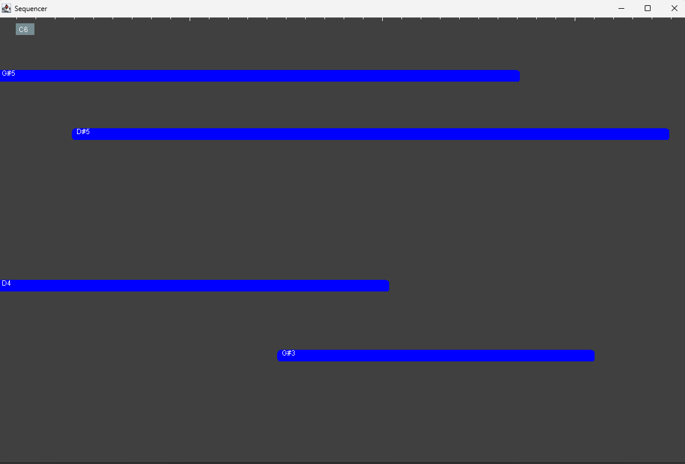

#  VegetableLoops
<hr>

## Table of Contents
- [Summary](#summary)
- [Installation](#installation)
- [Usage](#usage)
    - [Welcome Screen](#welcome-screen)
    - [Main View](#main-view)
    - [Sequencer Window](#sequencer-window)
- [Contributing](#contributing)
- [License](#license)

## Summary
**VegetableLoops** is inspired by the popular Fruit Loops Studio, mimicking its sequencer and project view. The project utilizes Java's built-in MIDI library and the sounds supported by it. Currently, there is no way to add more sounds.

## Installation
To install and run VegetableLoops, follow these steps:
1. Clone the repository:
   ```shell
   git clone https://github.com/yourusername/vegetableloops.git
   ```
2. Navigate to the project directory:
    ```shell
    cd vegetableloops
    ```
3. Build the project using your preferred IDE or build tool.

## Usage
### Welcome screen
 <br>
The welcome screen prompts the user to select a project to work on.
If a project already exists, the user can enter it directly.

### Main view
 <br>
OUpon entering a project, the user is presented with the main view. Here,
they can see previously created sequences or an empty screen for new projects.
On the left, users can set the properties of some instruments.
New sequences can be created by dragging next to one of the "instrument channels".
The user can manipulate the sounds in unison using the buttons on top

### Sequencer Window
 <br>
After highlighting a new sequence in the main view, this window will pop up.
Users can drag to create notes in the sequence,
which will also change the highlighted area. No explicit saves are needed.

## Contributing
Contributions are welcome! Please follow these steps to contribute:

1. Fork the repository.
2. Create a new branch:
    ```shell
    git checkout -b feature/your-feature-name
    ```
3. Make your changes and commit them:
   ```shell
   git commit -m 'Add some feature'
   ```
4. Push to the branch:
   ```shell
   git push origin feature/your-feature-name
   ```
5. Open a pull request.

## License
This project is licensed under the MIT License. See the [LICENSE](./LICENSE) file for details.